# FlightBatt measurements on MinimOSD #

For measuring the flight battery voltage there is some soldering necessary on the MinimOSD.

For measuring the flight battery ampere there is some soldering necessary on the MinimOSD and you have to use an extra current sensor.

---

Only do this if you have some good soldering skills, especially soldering directly at the ATmega 328p.

Also only do this if you have the knowledge of what you are doing.

If you do not have both, please wait for the OpenPilot OSD. With that, soldering is not necessary.

Bad soldering or less knowledge can risk your aerial vehicle and even lives!

---

Since I own the old version V0.1 of the MinimOSD with the heating problem, I first of all desoldered the diode to isolate the 12V from the OSD and powered it from the 5V side:

---

And I changed the 2x3 header to a 3x3 header to have the possibility to connect a current sensor:

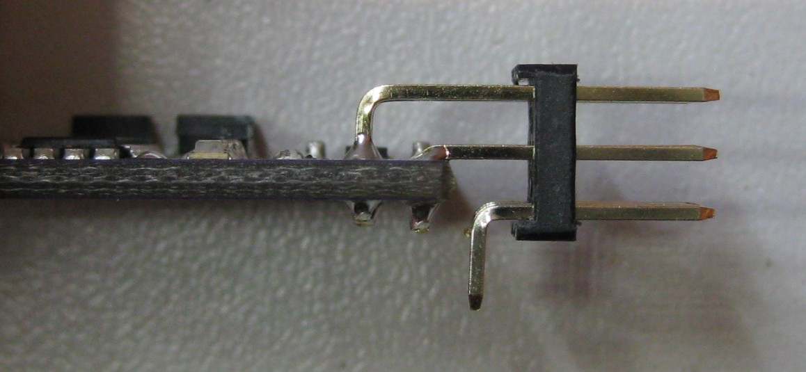

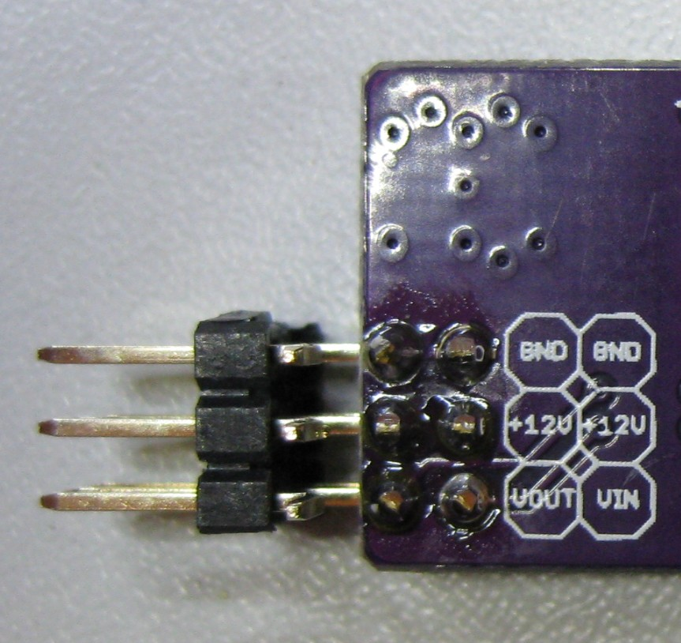

---

After that I soldered the cables which are connected to the flight battery:

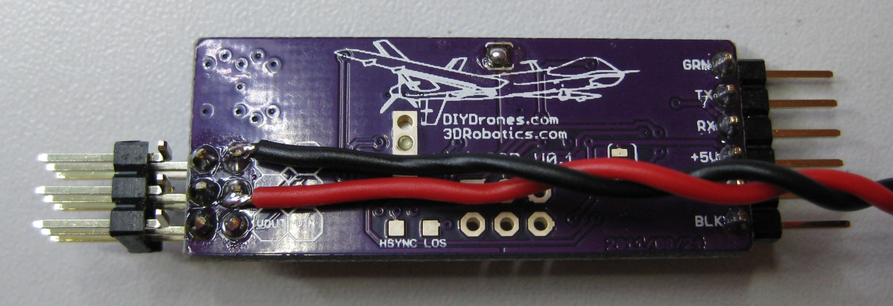

With that the FPV cam and the video transmitter can be powered by the flight battery and the flight batt voltage can be meassured by the voltage divider I soldered in the next steps.

But be aware: Check if your FPV cam and the video transmitter can handle the flight battery voltage you are using!

---

The necessary soldering for measuring the flight battery voltage is shown here without heatshrink for clarity:

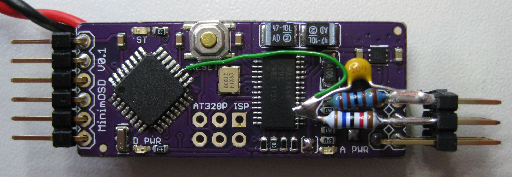

and with voltage divider heatshrink:

It is a voltage divider / filter using the following parts:

 **count** | **type** | **value** | **precision**
----------|---------|----------|--------------
1         | capacitor | 100 nF   |               
1         | resistor | 1.1 kOhm  | 1%            
1         | resistor | 16.0 kOhm | 1%           

You don't need to use exactly these values as it can be calibrated in the first 30 seconds after powering the OSD.

As long as the divider divides the highest voltage you are using to a maximum of 1.1V.

Calculate it with the following info from here: http://en.wikipedia.org/wiki/Voltage_divider

---

The soldering for current measuring, beware of the pin assignment at the connector, it depends on the used sensor:

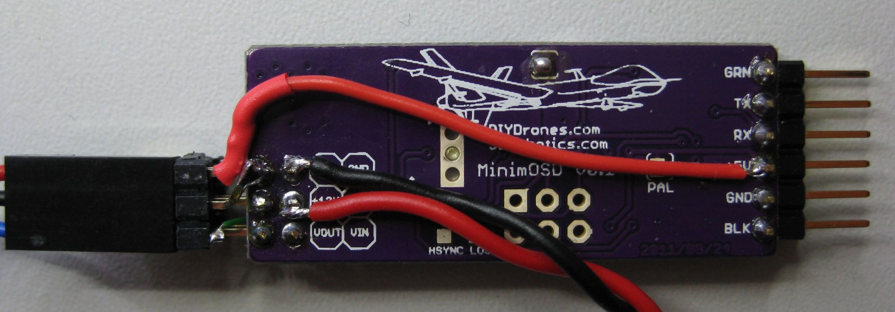

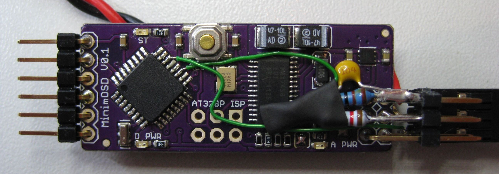

After the soldering for current measuring with complete heatshrink:

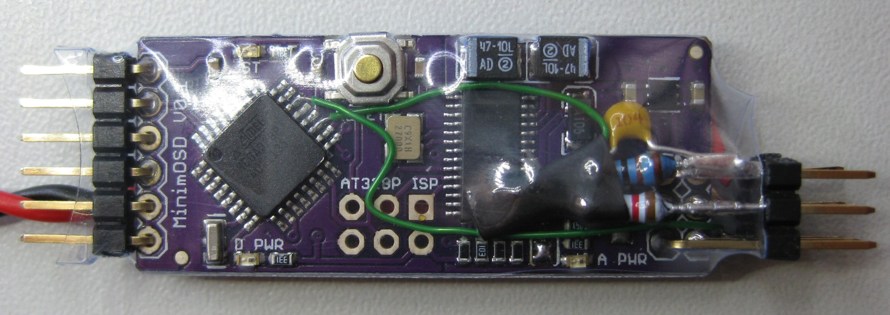

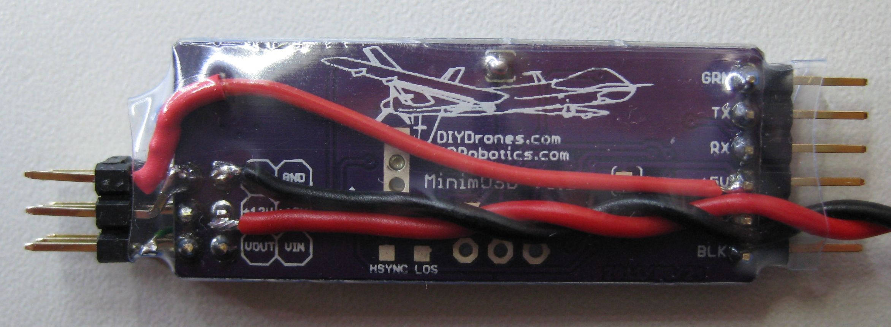

The current sensor needs a voltage divider, because we use the internal 1.1 V ADC reference of the ATmega 328p:

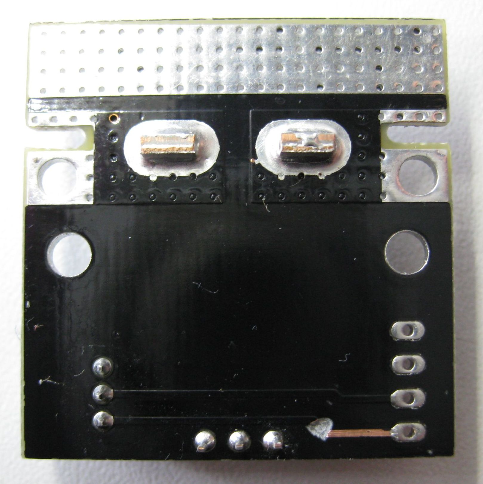

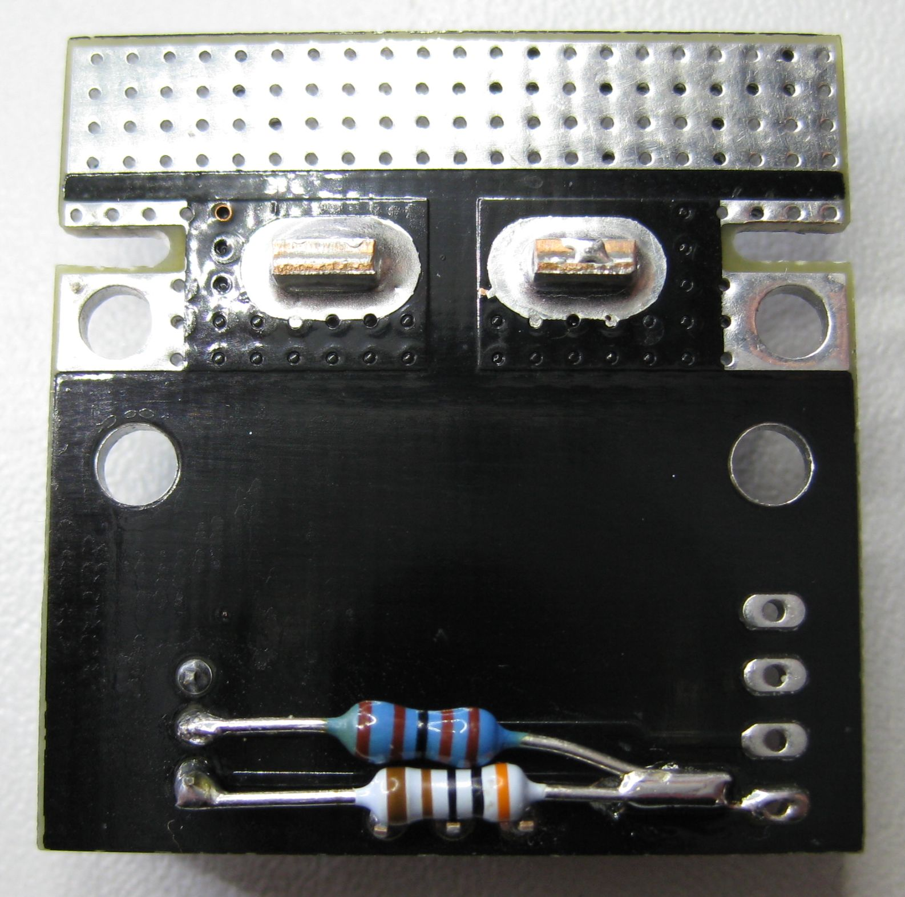

It is a voltage divider using the following parts:

 **count** | **type** | **value** | **precision**
----------|---------|----------|--------------
 1         | resistor | 1.1 kOhm  | 1%
 1         | resistor | 3.0 kOhm  | 1%

You don't need to use exactly these values as it can be calibrated in the first 30 seconds after powering the OSD.

Calculate it with the following info from here: http://en.wikipedia.org/wiki/Voltage_divider

The current sensor and the MinimOSD:

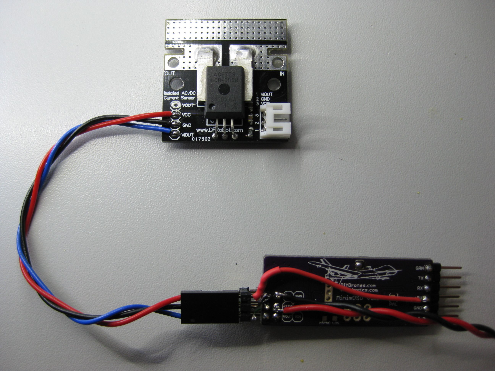

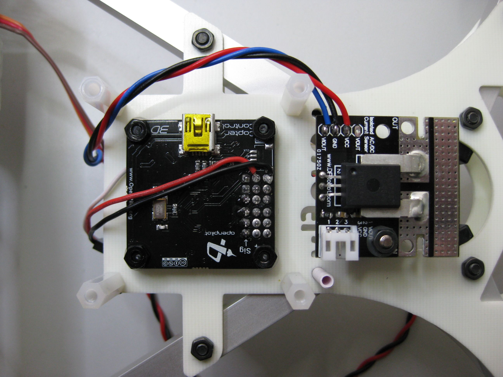

---

After the soldering you have to calibrate the system.

How to reach the calibration-menu see: http://code.google.com/p/minimosd-extra/wiki/OSD_menu

---

Here you can see the system with the connected cables:

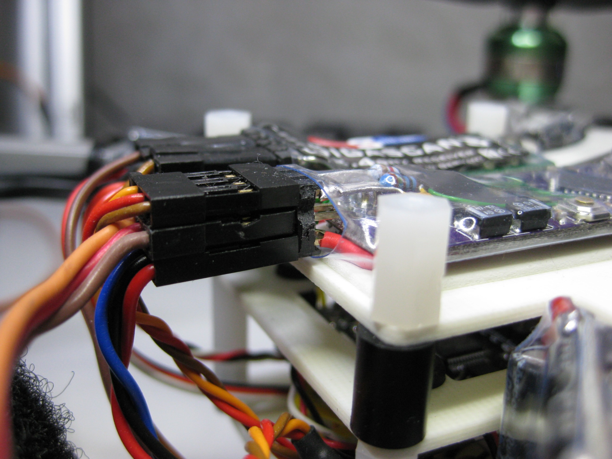

From top to bottom:

cable from FPVcam

cable to video transmitter

cable from current sensor

---

More info will follow on demand.

---
